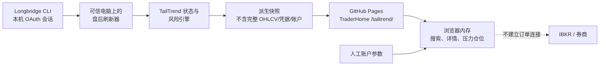

# TraderHome TailTrend Lab 开发目标与交接说明

> 文档状态：v0.2 影子测试交接稿（已吸收首轮评审）
>
> 编写日期：2026-08-13
>
> 线上地址：<https://traderhome-histroy.xyz/tailtrend/>
>
> 核心提交：[`c6a2e0c`](https://github.com/blikeywang/kezhou/commit/c6a2e0c572f7a3d0213351ebeff0df240a8e8497)
>
> 当前定位：研究与监控工具，不是自动交易系统

## 1. 一句话目标

把“价格充分回撤后只在下沿确认做多、上涨到上沿后管理或反向观察、区间中部不交易，同时允许真正被市场接受的突破继续跟随”写成一套可复现、可审计、有账户风险否决权的状态机，并先在 TraderHome 上影子运行几天，观察误判、漏判和执行问题后再迭代。

## 2. 为什么要开发它

最初的交易直觉有三个优点：

1. 只在赔率比较明确的区间边缘行动，避免在中间位置反复猜方向；
2. 入场、失效和止盈区域可以提前定义，心理压力和临盘随意性更低；
3. 现金是正式仓位，没有合适位置时不必强行做多或做空。

但如果只做静态区间反转，会遗漏或错误处理以下行情：

- SPXC 一类大幅下跌后的快速反弹；
- 无回踩的直线突破；
- 缓慢但持续的趋势；
- 假突破和上沿拒绝；
- 下沿真正破位后的趋势延续；
- 财报、跳空等普通 ATR 公式失效的行情；
- 多只同类股票同时触发、实际组合风险远高于单笔风险的情况。

所以系统不是简单的“低买高卖”，也不是原版海龟交易法。目标是把尾部均值回归、趋势跟踪、失败反转、事件隔离和组合风险控制放进同一个互斥状态框架中。

## 3. 已确定的产品原则

### 3.1 信号原则

- **触及不等于信号**：盘中碰到下沿不能直接接飞刀，至少等日线收盘重新收复边界。
- **中部不交易**：价格处于区间中部时默认不开新仓。
- **突破分两步**：先进入“突破候选”，再由后续收盘确认“趋势已接受”。
- **只给赢家加仓**：尾部核心仓与趋势预留仓共享一个想法的总风险，不因走势顺利而无限叠加风险。
- **状态与排序分开**：先把股票放入互斥状态桶，再在同一桶中安排人工复核顺序；优先级不是胜率或收益预测。

### 3.2 频率原则

采用“**信号判断慢、价格提醒快、风险控制实时**”的分层思路：

- 每周：全股票池与结构性参数复核；
- 每个美股收盘后：生成正式日线状态；
- 盘前（待开发）：检查财报、跳空、持仓和风险预算；
- 盘中（待开发）：只做候选边界提醒与已有仓位硬风险提醒，不用噪声推翻日线规则；
- 60 分钟快速探针：当前明确关闭，需单独回测后才可能启用。

当前版本 **只实现盘后日线刷新**。盘前和盘中层是已经确定的产品方向，尚未开发。

### 3.3 安全边界

- 不连接 IBKR 或其他券商账户；
- 不自动创建或发送订单；
- 不在网页、GitHub 或快照中发布 Longbridge 凭据；
- 不发布完整原始 OHLCV；
- 账户权益、回撤和风险参数只在当前浏览器内存计算，刷新即清除；
- 缓存或过期数据一律不得触发新仓；
- 美股做空必须另行核验借券、事件和账户权限；A/H/SG 市场不生成开空执行候选。

### 3.4 当前数据流与权限边界



Longbridge 被选为 v0.1 研究行情源，是因为现有环境已有受控认证和日线/财报日历读取能力，可以把数据获取与公开静态网站隔离。IBKR 更适合未来在获得明确授权后读取真实持仓、借券与执行信息；当前阶段刻意不让它进入信号扫描或网站运行链路。

## 4. v0.1 状态机

当前状态及动作如下：

| 状态 | 所属桶 | 当前动作 |
|---|---|---|
| `LOWER_TAIL_FALLING` | 边缘观察 | 下沿仍在下落，只观察，不接飞刀 |
| `LOWER_TAIL_RECLAIMED` | 下沿收复 | 尾部核心多头候选 |
| `RANGE_MIDDLE` | 中部不交易 | 不开新仓 |
| `UPPER_TAIL_DECISION` | 边缘观察 | 管理已有核心仓，等待突破或拒绝 |
| `BREAKOUT_CANDIDATE` | 趋势接受 | 等待后续日线接受，不追完整仓位 |
| `TREND_ACCEPTED` | 趋势接受 | 纯趋势仓候选，过度伸展时继续等待 |
| `BREAKOUT_FAILED` | 突破失败 | 退出趋势袖套，另行评估反转 |
| `UPPER_TAIL_REJECTED` | 突破失败/上沿拒绝 | 仅美股进入独立小风险做空复核 |
| `LOWER_TAIL_BREAKDOWN` | 下沿破位 | 先处理多头；美股再独立评估趋势空头 |
| `DOWNTREND_COVER_ZONE` | 边缘观察 | 空头减仓，等待下沿收复 |
| `EVENT_QUARANTINE` | 事件隔离 | 停用普通 ATR 仓位公式 |
| `OBSERVE` | 边缘观察 | 数据不足，不行动 |

## 5. v0.1 计算口径

以下参数是影子测试起点，不是已经优化出的最优参数：

| 项目 | 当前值 |
|---|---:|
| 尾部地图 | 前 60 个已完成交易日高低区间 |
| 上下尾部 | 区间各 20% |
| 波动单位 | Wilder ATR(20) |
| 历史波动率 | HV20，放入最多 252 日历史中计算百分位 |
| 突破缓冲 | 旧边界外 0.25 ATR |
| 趋势接受 | 3 日窗口中至少 2 个收盘留在边界外 |
| 过度伸展 | 距旧边界超过 1 ATR，暂不追仓 |
| 跳空隔离 | 开盘缺口超过 1.5 ATR |
| 事件隔离 | 已知未来事件距当前收盘 0–2 个日历日 |
| 趋势退出参考 | 日线收盘跌破 10 日低点 |

当前日不会参与自身 60 日边界计算，避免前视与自我污染。

### 5.1 管理规则起点

- 下沿收复：收盘为参考入场；硬失效在区间低点下方 0.25 ATR；中轴减 25%，上尾减 50%，剩余 25% 只有在趋势接受后才继续持有。
- 趋势候选/接受：以旧突破边界和近 3 日低点中较低者减 0.25 ATR 作为硬失效参考；趋势接受后使用 10 日低点跟踪退出。
- 上沿拒绝：硬失效在当前高点或区间高点上方 0.25 ATR；中轴与下尾为管理区，但只有美股且全部做空闸门核验后才可研究。
- 下沿破位：首先退出或处理原多头；趋势空头仍是独立的小风险美股模块。

## 6. 风险预算框架

仓位不是按“看起来有多确定”决定，而是按压力损失反推：

```text
每股压力损失 = |参考入场 - 硬止损| + 跳空准备金 + 滑点准备金
股数 = floor(允许的计划亏损 / 每股压力损失)
```

当前研究上限：

| 模块 | 初始风险上限 |
|---|---:|
| 高质量尾部总想法 | 账户权益 0.40% |
| 尾部核心袖套 | 总想法的 60% |
| 同想法趋势预留 | 总想法的 40% |
| 纯趋势 | 账户权益 0.20% |
| 美股做空 | 账户权益 0.15% |

账户与组合闸门：

- 高点回撤 5% / 8% / 10% 后，风险乘数降为 0.5 / 0.25 / 0；
- HV 百分位较高时继续缩仓；
- 普通组合计划风险上限 1.25%，硬上限 1.50%；
- 同一集群风险 0.60% 警戒、0.75% 硬阻断；
- 单日两次完整止损或当日已实现亏损达到权益 1%，停止新增风险；
- 流动性上限按 20 日平均成交额的 1% 约束。

这些数值当前只用于压力测试和形成一致纪律，不代表已证明具有最佳收益/回撤比。

## 7. 已经完成的开发工作

### 7.1 信号与风险引擎

文件：[`portal/vendor/tailtrend/tailtrend-engine.mjs`](../portal/vendor/tailtrend/tailtrend-engine.mjs)

已实现：

- K 线清洗、日期去重与排序；
- True Range、Wilder ATR、HV20 与历史百分位；
- 60 日尾部地图、周线环境、量比、成交额与缺口检测；
- 上述互斥状态机、状态桶、阻断原因和复核优先级；
- 下沿收复、趋势接受、失败反转和做空研究模块的管理价位；
- 回撤、波动率、周线、组合热度、集群风险、熔断与流动性共同作用的压力仓位函数；
- 缺少硬止损时拒绝计算，避免空值被错误解释为零价格。

### 7.2 Longbridge 盘后刷新器

文件：

- [`tools/tailtrend/refresh.mjs`](../tools/tailtrend/refresh.mjs)
- [`tools/tailtrend/universe.json`](../tools/tailtrend/universe.json)

已实现：

- 使用本机已认证的 Longbridge CLI；
- 初始扫描 30 个高流动性美股/ETF与 SPXC 个案；
- 每个标的读取 360 根前复权、正常交易时段日线；
- 分批读取财报日历；
- 并发、超时与最多 3 次重试；
- 单个标的刷新失败时可以保留上一份派生状态，但标记 `CACHED/STALE` 并强制禁止新仓；
- 只输出派生快照和最多 90 次运行历史，不输出原始完整 K 线。

目前 Longbridge 刷新必须在已认证的可信电脑手动执行。GitHub Actions 不持有 Longbridge 交易凭据。

### 7.3 TraderHome 页面

文件目录：[`portal/vendor/tailtrend/`](../portal/vendor/tailtrend/)

已上线功能：

- 每日数据健康、候选数、中部等待数和状态变化；
- 按状态桶筛选、代码/名称搜索和股票详情联动；
- 尾部地图、周线、ATR、HV、量比、成交额、管理区和阻断原因；
- 浏览器内存压力仓位计算器；
- 本地 JSON/CSV 日线导入，文件只在浏览器内存分析；
- 明确展示运行频率、研究边界和接下来要观察的问题；
- 已接入 TraderHome 首页、共享导航、构建清单、隐私契约和方法文档。

### 7.4 构建与部署

- 功能分支：`codex/tail-trend-lab`；
- 核心提交：`c6a2e0c feat(portal): add TailTrend shadow lab`；
- 已快进到 `main` 并由 GitHub Actions/Pages 部署；
- 部署工作流：<https://github.com/blikeywang/kezhou/actions/runs/31665450746>；
- 线上路由：<https://traderhome-histroy.xyz/tailtrend/>。

### 7.5 首轮评审后已修复

- 仓位计算现在必须继承状态机的 `newPositionAllowed`、数据新鲜度、事件/跳空隔离、状态阻断和做空资格；任何硬闸门失败都强制为 0 股；
- 策略袖套由标的状态自动选择并锁定，不能通过网页下拉框切换模块绕开；
- “突破候选”和“趋势已接受”拆成独立状态桶；
- 默认详情改为当天最高优先级的 `FRESH` 可执行候选；若没有可执行候选，才退回最高优先级的边缘复核标的；
- 每个标的增加状态原因、较上一真实交易日变化、下一状态条件及优先级加减分构成；
- 新增派生审计账本，逐日记录状态、阻断、次日参考、1/3/5/10 日 MFE/MAE 容器和人工覆盖字段；首日只建立基线，不补造未来结果；
- 760px 以下扫描表改为状态卡片，点击后使用可关闭的底部详情抽屉，不再依赖 860px 横向滚动表。

## 8. 已完成的验证

### 8.1 自动测试

首版发布前通过 49 项回归测试；首轮评审后又增加了状态硬闸门、模块绕开、做空资格和审计账本防重复测试。以最新 CI/本地测试输出为准。

- TailTrend 引擎：11 项；
- 原有 IncomeOS / TradeReview 浏览器引擎：27 项；
- TraderHome 门户、路由、隐私和构建：11 项。

TailTrend 测试覆盖：

- 数据清洗和 Wilder ATR；
- “触及”与“收复”必须分开；
- 突破候选、趋势接受和突破失败必须分开；
- 大跳空覆盖普通状态；
- 非美股不得进入开空候选，美股借券未核验也必须阻断；
- 回撤缩仓、组合热度、单日熔断与周线否决；
- 尾部核心与趋势预留共享一个总风险；
- 缺失止损不产生零价格错误；
- 汇总结果保持分桶，不混成单一神秘评分。

### 8.2 浏览器与生产验收

- 桌面端和 390px 移动端布局通过；
- 本地和公网搜索、筛选、标的切换和风险计算通过；
- 生产浏览器控制台 0 error、0 warning；
- 生产快照与运行历史请求均返回 HTTP 200；
- WMT 线上联动示例在默认 10 万美元账户参数下给出 11 股压力仓位，证明表单与信号详情之间的数据联动正常；该结果只是计算示例，不是建议下单。

## 9. 首份影子快照

数据日期：2026-08-12 美股收盘；数据健康：30/30 `FRESH`，0 错误。

| 状态桶 | 数量 | 标的/说明 |
|---|---:|---|
| 下沿收复 | 2 | COST、WMT |
| 突破候选 | 2 | BAC、JPM，尚未正式接受 |
| 趋势已接受 | 0 | 当前没有标的完成接受条件 |
| 突破失败/上沿拒绝 | 2 | HD、V；借券未核验，禁止执行 |
| 边缘观察 | 9 | 当前位于上沿决策区 |
| 中部不交易 | 15 | 明确等待 |

SPXC 个案：

- 收盘：218.18；
- 60 日区间位置：48.2%；
- 周线环境：上升；
- ATR/价格：约 4.53%；
- HV 历史百分位：98；
- 当前状态：`RANGE_MIDDLE / NO_TRADE_MIDDLE`；
- 正式动作：不开新仓。

这体现了当前框架的取舍：它不会因为 SPXC 曾经大跌反弹就追入区间中部；我们要在后续记录中判断这种主动放弃是否合理，还是确实需要一个经过独立验证的快速反弹状态。

## 10. 尚未完成或不能声称完成的部分

以下内容仍是明确缺口：

1. **没有策略有效性结论**：尚未完成 walk-forward、样本外、成本、滑点、公司行动和幸存者偏差验证。
2. **历史样本仍不足**：审计账本结构和基线已经建立，但目前只有 1 个真实交易日，尚不能计算可靠的候选到接受率、假收复率和状态持续时间。
3. **没有自动 Longbridge 日更**：刷新需要可信电脑手动运行，GitHub Pages 只部署已提交快照。
4. **没有盘前/盘中提醒**：事件复核和边界提醒的产品规则已写下，但通知服务尚未实现。
5. **没有实时行情或 60 分钟探针**：快速通道当前关闭。
6. **没有 IBKR 组合同步**：风险表单依赖人工输入，无法自动识别真实持仓、行业相关性、借券或保证金状态。
7. **没有真实可成交性模型**：当前没有 bid/ask、盘口深度、实际借券费和个股级滑点模型。
8. **股票池很小且固定**：30 个标的适合人工审查，不代表完整市场筛选能力。
9. **优先级尚未校准**：它只用于安排复核顺序，不应解释为概率或 alpha。
10. **财报隔离仍需加强**：应继续验证时区、盘前/盘后财报和临时事件变化。
11. **盘前缺口口径尚未实现**：当前缺口只在收盘状态中使用当日 ATR 归一化；若开发盘前提醒，应改用上一完整交易日 ATR，不能直接复用当前口径。

## 11. 希望评审同事重点检查什么

### 11.1 量化/策略评审

- 状态是否真正互斥，边界日是否存在顺序依赖或隐藏前视；
- 60 日/20% 尾部是否应按波动率、行业或趋势环境自适应；
- 2/3 收盘接受规则是否太慢，1 ATR 追涨上限是否合理；
- 尾部退出和趋势退出是否会在同一个想法中相互打架；
- V 型反转、慢趋势和无回踩突破应新增状态，还是应当有意放弃；
- 风险乘数是否会重复惩罚同一风险来源；
- 是否需要指数/行业环境作为硬闸门而非仅用个股周线。

### 11.2 数据工程评审

- Longbridge `forward + intraday session + day` 的字段、复权和交易日口径；
- 财报日历解析、时区、缺失值与缓存回退；
- 360 根日线是否足够稳定地计算 252 日 HV 百分位；
- 快照 schema 是否需要校验器和兼容版本迁移；
- 自动日更应放在自托管 runner、可信服务器还是独立数据服务；
- 是否需要把运行日志、状态迁移和异常写入独立数据库。

### 11.3 前端/产品评审

- 状态、动作、阻断与仓位预算是否容易被误解为喊单；
- 移动端表格与详情是否需要改为卡片/抽屉；
- 是否应新增“相对上一日变化”“为何变化”和历史状态时间线；
- 空仓/等待是否足够显眼；
- 本地导入功能是否需要更严格的 CSV 解析和文件大小限制。

### 11.4 安全/合规评审

- 公开派生价位是否符合数据供应商授权范围；
- 快照是否还需减少精确价格或增加延迟标签；
- CSP、静态资源完整性、文件导入与 DOM 渲染边界；
- 将来若接入通知或账户，认证、权限与数据隔离应该如何设计；
- 投资建议边界与页面文案是否足够明确。

## 12. 建议的下一阶段

建议先连续运行 5–10 个完整交易日，不立即优化参数。每天保留下列审计字段：

- 昨日状态、今日状态和触发该变化的具体条件；
- 候选提醒价、下一可成交参考价与滑点；
- 1/3/5/10 日最大有利和最大不利波动；
- 是否发生事件、跳空、借券或组合闸门阻断；
- 被系统主动放弃但事后大幅运行的行情类型；
- 同一集群同时触发数量与压力期相关性；
- 人工是否覆盖系统，以及覆盖理由。

积累最少 5–10 日状态迁移后，再按以下顺序推进：

1. 增加历史状态时间线和每日差异报告；
2. 建立可复现的历史状态回放与 walk-forward 测试；
3. 加入交易成本、滑点、退市和公司行动处理；
4. 再决定是否扩充股票池与引入盘中提醒；
5. 只有快速探针在样本外显著改善“漏掉趋势”且没有破坏风险后，才考虑启用；
6. 在没有账户级权限、审计和熔断服务前，继续禁止自动下单。

## 13. 本地运行与复核

从 TraderHome 仓库根目录执行：

```bash
# 美股正常交易时段收盘后刷新派生快照
node tools/tailtrend/refresh.mjs

# TailTrend 引擎测试
node --test portal/test_tailtrend_engine.mjs

# 门户、构建和隐私测试
python3 -m unittest portal.test_portal

# 构建完整静态站
python3 portal/build_site.py
```

相关入口：

- 方法总文档：[`docs/METHODS_AND_SOURCES.md`](METHODS_AND_SOURCES.md)
- 产品边界：[`docs/TRADERHOME_PRODUCT_SYSTEM.md`](TRADERHOME_PRODUCT_SYSTEM.md)
- 部署说明：[`docs/DEPLOY.md`](DEPLOY.md)
- 刷新器说明：[`tools/tailtrend/README.md`](../tools/tailtrend/README.md)
- 引擎测试：[`portal/test_tailtrend_engine.mjs`](../portal/test_tailtrend_engine.mjs)

## 14. 免责声明

本输出内容仅供参考，不构成投资建议。海龟交易法是趋势跟踪策略，在震荡行情中可能频繁止损，历史表现不代表未来收益。投资有风险，入市需谨慎。

## 15. 评审反馈模板

建议评审者直接按下面格式反馈，方便归并：

```text
评审人 / 方向：
结论：可继续影子测试 / 修改后测试 / 暂停
必须修复：
可以延后：
认为会误判或漏判的行情：
需要补充的测试或数据：
建议优先级：P0 / P1 / P2
```
